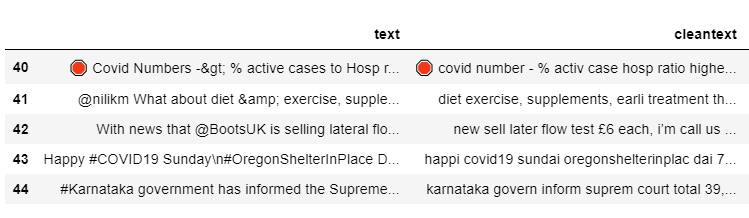
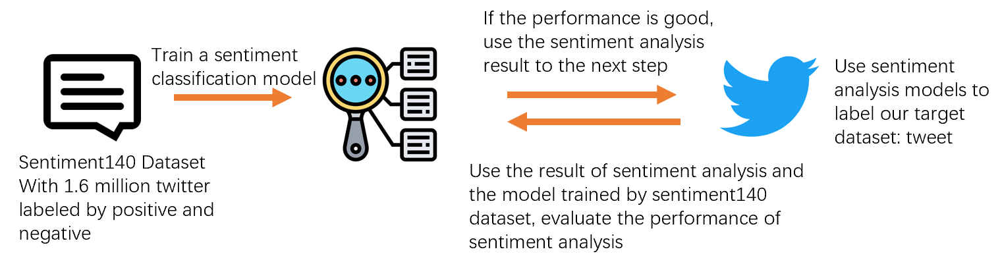
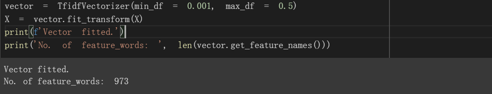
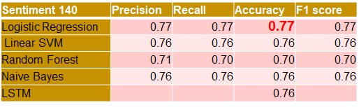
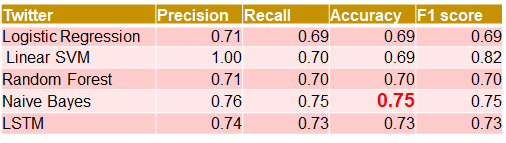
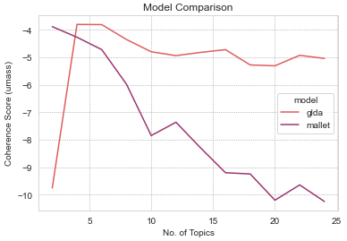
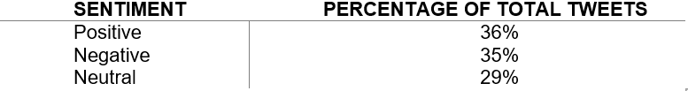
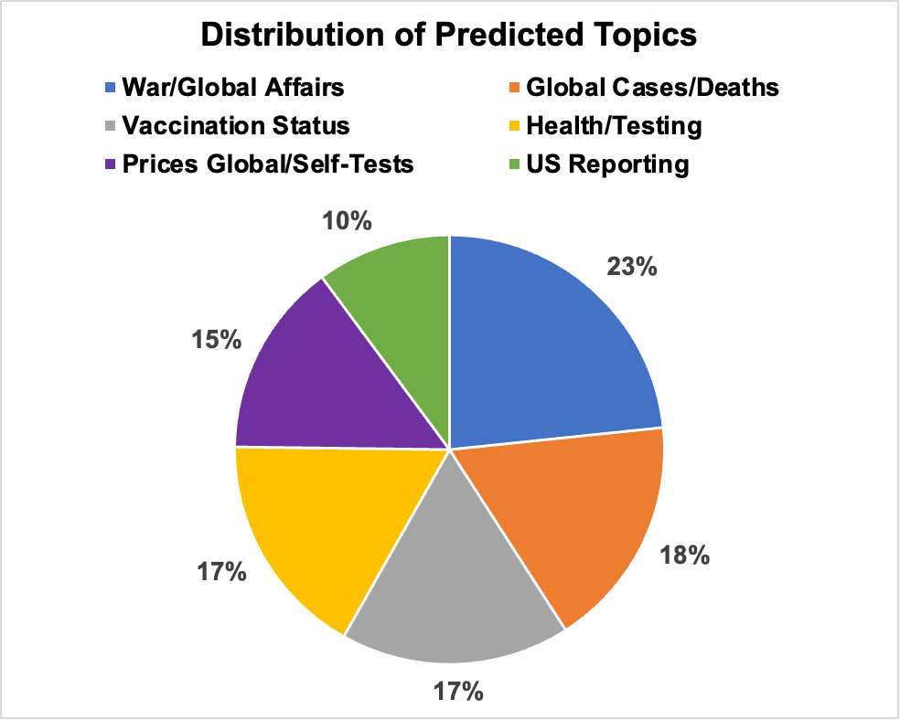
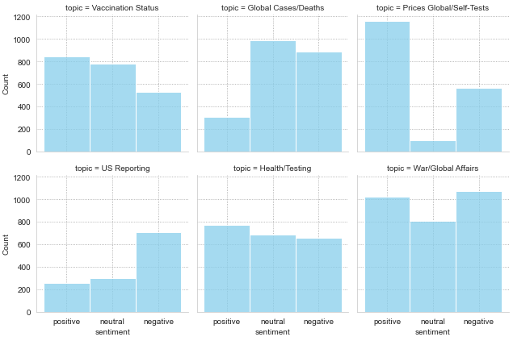

```{r setup, include=FALSE}
knitr::opts_chunk$set(echo = FALSE)
```

# 1.0 Introduction

Since the start of the COVID-19 pandemic, people have been using Twitter to share news, information, opinions, and emotions on COVID-19 related matters (Yu M, 2020) . Social media have provided an outlet for expressing views and feelings during this period. Research has shown that the number of Twitter users increased at a faster rate compared with pre-pandemic periods, experiencing higher year-on-year growth (Iqbal, 2022) .

Topic modeling and sentiment analysis have been widely used to identify issues and people’s opinions about COVID-19–related issues. Analyses were conducted to identify patterns of health communications in diverse kinds of data sources, communities, and locations. Most of the research focused on social media such as Reddit posts (Daniel C. Stokes MS, 2020)  and tweets (Michelle Odlum, 2020) . 

Our motivation for this work is to extract information that can support campaigns for improving COVID-19 related support measures taken by governments or companies. The COVID-19 pandemic has forced a major shift in how employees are working (now mostly Working from Home (WFH)). Enterprise social networking platforms such Yammer and employee perception surveys conducted internally can be seen as an effective enterprise-wide barometer of staff sentiment. They are playing an increasingly important role as organizations look to navigate their way through this current global predicament. Research has shown a record levels of Yammer activity during the transition period to WFH and the levels of responsiveness and engagement between staff increased (Lee & Dawson, 2021) . Our analytical approach can be used for analyzing company survey results (focusing on free-form questions), Yammer post, comments and general employee feedback to understand employee sentiments and topics of conversations. We aspire to generate an analytical model with public tweets and methods like sentiment analysis and topic modelling that helps organizations understand the sentiments and topics expressed by employees during this pandemic, so companies can provide support of policies to address employee well-being. 

# 2.0	Methodology
Our goal was to understand the disposition of people during the COVID-19 pandemic through posts on Tweeter aka tweets. The analytical approach is summarized below and a visual representation has been included in the appendix.   
**Study Data**  
We first collected tweets (raw data) with a COVID-19 hashtag through the Twitter API. Due to the large amount of data available and download speed limitations, we focused on three-days' worth of data in this work. Our COVID-19 tweets dataset includes over 14,000 tweets posted between 4 and 6 March 2022, both days inclusive. The dataset comprises 13 features including among others username, user location, user description, tweet date and tweet text.

An additional dataset was Sentiment140 dataset, which includes 1.6 million tweets, labelled as negative, positive and neutral. Apart from the sentiment feature (categorical variable), the dataset includes the date of the tweet, user, and text. The dataset is in the public domain the link is provided in the appendix.  

**Study Approach**  

Tweets were first pre-processed and prepared for analysis. Analysis then proceeded on three parallel tracks. The first track involved lexicon-based sentiment analysis using the VADER library. The second track utilized classification algorithms (Logistic Regression, Support Vector Machines, Naïve Bayes) trained on the Sentiment140 dataset. As our COVID-19 tweet dataset is not labelled, classification algorithms were used to validate the lexicon-based sentiment analysis.  

The third track involved topic modeling based on Latent Semantic Analysis [**LSA**](https://en.wikipedia.org/wiki/Latent_semantic_analysis) and Latent Dirichlet Allocation [**LDA**](https://en.wikipedia.org/wiki/Latent_Dirichlet_allocation) using the scikit-learn and Gensim libraries. Each track is discussed in more detail below.  


# 3.0 Solution Details
### 3.1 Text Pre-Processing
Our raw dataset has 13 features. There were no “re-tweets” to remove. Our tweets cover only three days and therefore temporal analysis would not be meaningful.  We only kept “text” feature for analysis. The raw text was pre-processed prior to analysis as follows:

+ Tweets converted to lowercase 
+ Removal of URL links 
+ Placeholders (These are often inserted with a link or video and make no sense for our analysis)
+ HTML reference characters
+ Removal of characters like @ &'#' to eliminate unnecessary factors that will affect our analysis)
+ Non-Letter characters such as punctuations and some emojis are were removed for topic modeling and sentiment analysis using Sentiment 140 but were kept for sentiment analysis using VADER. As discussed before, VADER is able to take these into account.
+ Tokenize
+ Stop words for tokens (Remove stop-words using the stop-words list from NLTK)
+ Stemming for tokens (Reduce the words to their derived stems)
+ Remove hyphen (-) in tokens
A comparison between the original text and cleaned text using the steps above is shown below.  


{width=120%}
  

### 3.2 Lexicon/Rule-Based Sentiment Analysis
For lexicon-based approaches, a sentiment is defined by its semantic orientation and the intensity of each word in the sentence. Generally, a text message will be represented by bag of words.

TextBlob is a Python library for lexicon-based sentiment analysis. TextBlob returns the polarity and subjectivity of an input sentence. Polarity lies between [-1,1] with ‘-1’ defining a negative sentiment and ‘1’ defining a positive sentiment. (Barai, 2021)   VADER (Valence Aware Dictionary and Sentiment Reasoner) is another lexicon-based sentiment analyzer that has pre-defined rules for words or lexicons.

A comparison between Texblob and VADER showed that TextBlob is underperforming with negative sentences, particularly negations. Furthermore, VADER also considers the impact of exclamation marks, slang and emojis, emphasis into the compound score. In social media Emojis are often used to express emotion, so we chose VADER-lexicon method to proceed our sentiment analysis.

The criteria for classifying text based on compound scores is: (Positive: compound score >= 0.05), (Neutral: -0.05 < compound score < 0.05), (Negative: compound score <= -0.05).  


### 3.2 Classification Using Sentiment140
Our raw dataset of COVID-19 tweets is not labelled and manually labelling the tweets would be time-consuming. Instead, we used Sentiment 140, a dataset which contains 1.6 million twitter messages, with positive or negative labels to train different classification models and compare predictions with the rule-based approach. Every class (positive or negative) represents 50% of the dataset, so the data is balanced.  

**Analysis process**  


{width=120%}
  

**Model building**  

TF-IDF (term frequency-inverse document frequency) associates each word in a document with a number that represents the importance of that word - frequent in that document but not across documents. By vectorizing the documents and converting text data to a numerical format, we are then able to apply different supervised learning models.  

For reducing calculating task and time of training model, we set max_df as 0.5, since the positive data and negative data contain 50% of all documents respectively, in an extreme situation that all the positive ones have a typical word, we don’t ignore it, and min_df as 0.001 to reduce the vocabulary shape.  


{width=120%}
 

**Classification models**  

We chose classification models such as Naïve Bayes, Logistic Regression, SVM and Neural Networks. Performance in term of accuracy was comparable among the different models (see Experiment section.  

### 3.3 Topic Modeling 
In this project we used, Latent Semantic Analysis (LSA) and Latent Dirichlet Allocation (LDA) for topic modelling. Implementation of the LDA technique was done using three different algorithms, namely:  

+ LDA model included in the Gensim library.  
+ LDA model included in the scikit-learn library  
+ LDA model in the Mallet library    


The challenge with using different models was choosing the most appropriate. We used the Coherence score for to compare results from the different algorithms. Comparing results from models of different libraries presents an additional challenge and we used our own judgement based on the predicted topics.    

Another challenge was using mallet with newer versions of the gensim library since newer versions no longer support the mallet wrapper. We included in the GitHub code in a separate .py file and imported manually.    

# 4.0 Experiments  
### 4.1 Sentiment Analysis Using Supervised Learning  
As discussed above, we used different supervised learning models to classify tweets into positive and negative. We experimented with different parameters in each model but the effect on accuracy was not significant. Since the dataset is balanced, Precision, Recall and F1 score are quite similar to accuracy. The performance of each model on the Sentiment 140 (training) data was about 75%.  


{width=120%}


We combine positive text and negative text into a combination data frame and using all the Sentiment140 data frame as training data, fit in and produce new models, using the combination data as test data.  


{width=120%}


### 4.2 Topic Modelling
As discussed above, we experimented with different models and libraries for topic modelling. We used the Coherence score for each model and evaluated the value of this score over different values for the number of topics to select: 1) the best performing model, and 2) the most suitable number of topics. An example is shown below comparing the coherence score between the LDA model in Gensim and the LDA model in Mallet.   

We experimented with topic values ranging from 2 to 24 and extracted the coherence score at each stage. We used the ”umass” score as it was readily available for all models. However, scikit-learn scores were significantly different from the Gensim LDA and Mallet scores and likely not directly comparable. In this case, we compared the predicted topics among the models for consistency. The predicted topics by LSA and LDA models in scikit-learn were comparable with the topics predicted by mallet.  


{width=120%}
 

In addition, majority of models showed that the number of topics with the highest average coherence is 6. We proceeded with mallet as our model choice with 6 as the number of topics based on the coherence score as well as visual inspection of the topics.   

# 5.0 Results and Analyses
### 5.1 Sentiment Analysis Results
Since the performance on the training set was similar for all supervised learning models (trained on Sentiment140) we tested, we chose Naïve Bayes to obtain predictions. We also obtained predictions using the VADER lexicon. Comparison between the two approached showed an agreement of about 80 percent. We note that we performed a comparison between Positive and Negative predictions only since Sentiment140 does not include Neutral labels.   

Since our raw data do not contain labels, it was challenging to determine which approach performs better. However, we considered this agreement reasonable and chose to proceed with VADER (rule-based).   

The overall distribution of predicted sentiments in the table below shows an almost equal split among the three different sentiments predicted, i.e., positive, neutral, and negative.  


{width=120%}
 

### 5.2 Topic Modelling Results
The approach for determining the topics for the dataset and the most relevant topic for each tweet was described above. The following table shows the number of topics that we selected, the keywords in each topic and our labelled topic.   

TOPIC NO. | KEYWORDS | LABEL
------------- | ------------- | -------------
1 | tests, flow, lateral, selling, cost, price, pandemic, commit, calling, global | Prices (Global/Self-Tests)	 
2 | cases, coronavirus, total, deaths, march, today, 2022, india, omicron, active | Global Cases/Deaths
3 | world, ukraine, years, time, virus, russia, war, government, good, ukrainerussianwar | War/Global Affairs
4 | people, health, test, propaganda, public, testing, back, study, covidisnotover, 2020 | Health/Testing
5 | analytics, data, latest, team, county, publichealth, insights, datascience, 2022-03-01, globalhealth | US Reporting By County 
6 | vaccine, vaccination, vaccines, vaccinated, administered, masks, doses, mask, read, china | Vaccination Status  
 		
In general, the algorithm does reasonably well in determining broad categories for the dataset tweets. Given that the dataset includes tweets over a period of only three days, our hypothesis was that topics would focus mostly on current affairs and not cover wide range of topics, taking also into account that we chose tweets with the covid-19 hashtag.  

The overall distribution of predicted topics is shown in the figure on the left. There is a similar split by topic. Most tweets were assigned to the War/Global Affairs topic and the least number of tweets are about reporting of cases in the USA. There is similar representation of the remaining topics ranging between 15% and 18%.  


{width=120%}  

Our dataset is not labelled, and we could only evaluate the accuracy of the topic modelling through visual inspection. As expected, the topic of some tweets is wrongly predicted but overall, the model appears to be doing a reasonably well. Further work could lead into better results, and this is discussed in later sections.  

+ Topic 1 includes tweets with almost identical text. These tweets are about the prices of lateral flow tests in the UK, asking pharmacies (e.g., Boots) to sell these tests at cost. 
+ Topic 2 includes tweets with updates about cases globally, with India standing out.
+ Topic 3 is the most interesting because of the overlap of COVID-19 with the war in Ukraine. A quick visual inspection showed that a few tweets with this topic have to do with the fact that the war has removed COVID-19 from the headlines.
+ Topic 4 is a mix of issues ranging from health effects to misinformation and propaganda about wearing masks and not being vaccinated. 
+ Topic 5 includes similar tweets, pertaining to COVID-19 statistics for USA counties. 
+ Topic 6 is about vaccines and vaccination status globally ranging from vaccination country statistics to vaccination travel requirements  

The distribution of sentiments by topic is shown in the following figure.  


{width=120%}
 

For the Prices/Self-Tests topic, we see a larger percentage of positive topics (63%). This was a challenging topic because the majority of tweets are requests to UK pharmacies to sell lateral flow tests at cost. The language in some of these tweets implies indignation at the price of these tests, hence the request. However, it is implied rather than explicitly stated. Other tweets with the same topic are more direct. An example is as follows:  

**1.	Positive Prediction (Prices/Self-Tests Topic):** “*@BootsUK* *@LloydsPharmacy* *@LidlGB* *@superdrug* will you commit to selling lateral flow tests at cost price, rather than profiting from a global pandemic? *#COVID19*

**2.	Negative Prediction (Prices/Self-Tests Topic):** “Right now we’re facing skyrocketing prices and the additional costs of lateral flow tests could be an unaffordable burden. That’s why I’m calling on you *@BootsUK* *@LloydsPharmacy* *@LidlGB* *@superdrug* to commit to selling these tests at cost price. *#COVID19*.  

As expected, the Cases/Deaths topic has a low number of positive tweets (14%). The split between neutral and negative cases has to do with a split between tweets that present facts (cases) and tweets that include negative words like death, sickness etc. Similarly, for the USA Reporting Topic, the higher percentage of negative sentiments (56%) is due to the inclusion of the word “death” in the statistics. Remaining topics have similar split among the sentiments.  

# 6.0 Discussion and Gap Analysis
This analysis shows that topic modelling and sentiment analysis using available libraries can be used to extract insights about views and sentiments on a topic discussed on social media or any free-form text. However, the analysis presented in the report has limitation that can be addressed in future work on this topic. These include:  

+ Dataset comprised only three-days' worth of tweets precluding temporal analysis
+ Dataset was not labelled; hence we could not obtain a quantitative accuracy measure beyond visual inspection. 
+ Further, more detailed cleaning could improve the analysis. For example: 
+ Many non-letter characters used in tweets affect the pre-process accuracy
+ Hard to only leave the emojis and punctuations, as most methods apply to whole non-letter characters
+ Rule-based sentiment analysis is based on explicitly defined scenarios in the algorithm. For example, Vader considers the contextual effects of “but,” but not similar conjunctions like “although” or “however.”
+ Word count in positive tweets is lower than negative ones
+ Use of deep learning techniques (e.g., random forest model) is limited by the large number of data coupled with laptop processing power
+ Comparing the performance of the same techniques implemented in different libraries is challenging, which in turn increases  

# 7.0  Work and Conclusion
Our future scope has 3 tasks to work with, the first is to find more about how to classify the sentiment level of people by more layers, for example, is the ‘like’ ‘very like’ or just ‘normally like’? To achieve this, we need to find a solution to define a score benchmark and use the calculation of the results to match with the benchmark to get the corresponding answer.  

The second is to scale the model to learn about general public’s opinions about the COVID-19 topics, moreover, this could reflect people’s instant feedback about the current affairs, like government policies facing the covid situation.  

Lastly, this could finally be developed into a product with multiple functions to apply to companies. With an input module, an API linkage to the updating dataset to set up the model with capability of extracting data in certain frequency, a dynamic monitor dashboard could be established to achieve easy and transparent visualization of historical data and to provide insights for strategic decision making.  

Large multinational companies conduct periodic surveys to obtain employee feedback on various topics that affect them. This can also be used in enterprise social networking platforms to monitor employees’ sentiments towards other essential topics, such as local government response to the pandemic situation, healthcare support by company, offline examination, and mental health by using DL algorithms to increase their performance on the dataset.  


