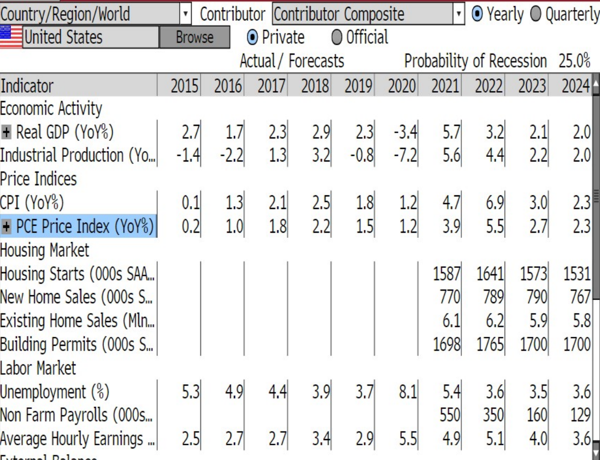

```{r setup, include=FALSE}
knitr::opts_chunk$set(echo = FALSE)
```

# 1.0 Overview 
# 1.0 概述  

The [**Ukraine War**](https://www.nytimes.com/news-event/ukraine-russia?name=styln-russia-ukraine&region=TOP_BANNER&block=storyline_menu_recirc&action=click&pgtype=LegacyCollection&variant=show) has posted great pressure on the Europe's Energy supply, causing significant increase in the living cost of citizens. Also, the pandemic lock-down of Shanghai in China continues, with increasing number of new test-positive cases arising. It is estimated to last till early May, but the government has authorized some enterprises to operate as usual to meet the demand of manufacture, such as Tesla (auto-mobile) and power industry companies.  

乌克兰战争给欧洲的能源供应带来了巨大压力，导致公民生活成本大幅增加。 此外，中国上海的新冠封锁仍在继续，出现了越来越多的新检测阳性病例。 预计将持续到5月初，但政府已授权部分企业照常运营以满足制造需求，例如特斯拉（汽车）和电力行业公司。  

# 2.0 US Economic Indicator 2022 Q1  
# 2.0 美国经济指标 2022 第一季度  

The Q1 US GDP report is yet to be released, but some economic indicators could provide some clues of the short-term US economy outlook. From Change in [***Nonfarm Payrolls***](https://www.bls.gov/news.release/empsit.toc.htm) indicator, the actual value (431k) is far less than the estimated median value (490k), which is a negative surprise. The monthly change in the number of employees in the U.S is over-optimistic estimated by economists. The [***ISM Manufacturing***](https://www.ismworld.org/) indicator shows that the US PMI (57.1) is slightly less than estimated (59.0), but it is still a positive signal (>50). The [***unemployment rate***](https://www.bls.gov/news.release/empsit.toc.htm) in Mar (3.6%) is better than expected (3.7%). However, the [***CPI YoY***](https://www.bls.gov/news.release/cpi.toc.htm) rate almost reaches historical high at 8.5%. Considering the Fed is planning to increase 4 times by 25 bps, the interest rate is estimated to be at 2.00% to 2.25% at end of 2022. The CPI rise should be slowed down by the aggressive monetery policy.  

从非农就业人数变化指标来看，实际值(431k)远低于估计的中值(490k)，这是一个负面的意外。 经济学家对美国员工人数的每月变化进行了过度乐观的估计。 ISM 制造业指标显示，美国 PMI（57.1）略低于预期（59.0），但仍是积极信号（>50）。 3 月份的失业率（3.6%）好于预期（3.7%）。 然而，CPI 同比增长率几乎达到 8.5%的历史高位。 考虑到美联储计划四次加息25个基点，预计 2022 年底利率在 2.00% 至 2.25% 之间。激进的货币政策应该会减缓 CPI 的上涨趋势。     
{width=120%}  

### 2.1 US nonfarm composition (美国非农细分)  

The services (Lower Paying) showed weak increase trend, which is the main reason the value of March did not reach the target. The services (Higher Paying) increase was strong，but the mining,logging, construction also did not boost.  

服务业（低收入）呈现疲软的增长趋势，这是3月份数字未达到目标的主要原因。服务业（高收入）增长趋势强劲，但采矿、伐木、基建没有较大提振。  


{width=120%}  

### 2.2 US PMI composition (美国采购经理指数细分)  

The new orders and production showed weak trend, which means that companies did not expect the new order and production to be strong. The war and high inflation will diminish people’s consumption, which inverse decreases the demand and supply as well. As shown in the graph, inventories increase a bit.  

新订单和新生产呈现疲软趋势，这意味着企业并未预期新订单和新生产会强劲。 战争和高通胀会减少人们的消费，反过来也会减少需求和供应。如图所示，库存略有增加。  
{width=120%}  

### 2.3 US CPI composition (美国消费者物价指数细分)  

The CPI index, as shown in the graph, have been increasing for continuous months, the energy sector experienced a high increase (mainly by oil price fluctuation), the food sector remained relevantly stable, the goods sector increase trend was slowed down compared to FEB. The Services sector was still rising at accelerated speed.  

如图所示，消费者价格指数连续数月上涨，能源板块涨幅较大（主要受油价波动影响），食品板块相对平稳，商品板块涨幅较2月有所放缓 . 服务业仍在加速上涨。    
{width=120%}  

# 3.0 China Economic Indicator 2022 Q1  
# 3.0 中国经济指标 2022 第一季度  

China 2022 Q1 GDP data will be released on 18th of April. From the monthly data, in March CPI has an over-performance increase at 1.5%, slightly over the estimated median value of 1.4%. The PMI value is 48.1, a little below the estimated 49.9 (<50 of course), which shows the lack of business confidence of the short-term economy. In terms of the trade, in March China export has a rise of 14.7% compared to 12.8% as estimated, which is a positive surprise. However, the import market seems to have a waterfall drop to -0.1%, which is far below the estimated +8.4%, surprisingly negative.  

中国2022年第一季度GDP数据即将在4月18日公布，从目前的数据来看，三月消费者物价指数同比增长1.5%，高于预期均值(1.4%)。采购经理指数(48.1)略低于预期(49.9),同时低于50，表明对当前经济短期的信心略显不足。同时重点关注一下进出口贸易，中国3月出口同比增长14.7%,进口同比下降0.1%,出口略超预期的同时进口远低于预期。    

{width=120%}  

### 3.1 China CPI Review (中国消费者价格指数回顾)  

Since the pandemic, China has recovered fast and achieved a historical increase in real GDP in 2021 Q1, now it gradually comes back to normal level at about 4%. With government’s economy stimulation policy, the consumption is estimated to rise in the future, the CPI increase is expected to exceed 2%, which is a common target value.  

疫情以来，中国经济快速复苏，2021年第一季度实际GDP实现历史性增长，现在逐步恢复到4%左右的正常水平。随着政府的经济刺激政策，预计未来消费将上升，CPI涨幅有望超过2%，这是一个公认的目标值。
{width=120%}  

### 3.2 China PMI Review (中国采购经理指数回顾)  

Most of the time in recent years, the PMI value is fluctuated around 50, in the next coming years, the post-pandemic recovery of economy is still expected to bring new opportunities.  

近年来大部分时间PMI值在50左右上下波动，未来几年，疫情后经济复苏仍有望带来新机遇。    

{width=120%}  

### 3.3 China Trade Review (中国进出口贸易回顾)  

The lock-down effect of Shanghai is yet to reflect on the export/import figure. It is almost sure the export/import will not repeat the 2021 Q1’s boost. The shipping cost will remain or reduce to relatively lower level in the next coming quarters. Short-term export/import will likely to see an aggressively fluctuation in next months.  

上海的封锁效应尚未反映在进出口数据上。几乎可以肯定，出口/进口不会重复 2021 年第一季度的增长。 未来几个季度，运输成本将保持或降低至相对较低的水平。 未来几个月，短期进出口可能会出现剧烈波动。    
{width=120%}  

# 4.0 Future Outlook  
# 4.0 未来展望  

{width=120%} 

In summary, the US will likely to see a long-term CPI drop back and stable  GDP growth at about 2% annually. China GDP growth is likely to stay around 5% level, which is still leading compared to the developed countries. The probability of Recession of China (10%) and US(25%) is low.  

综上所述，美国可能会看到长期的 CPI 回落和每年 2% 左右的稳定 GDP 增长。 中国GDP增速有望保持在5%左右，与发达国家相比仍处于领先水平。中国（10%）和美国（25%）经济衰退的概率很低。  

{width=120%} 


{width=120%}    


